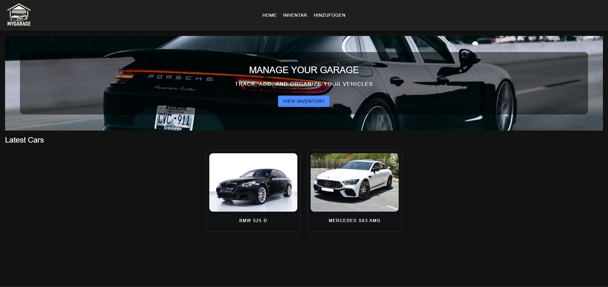
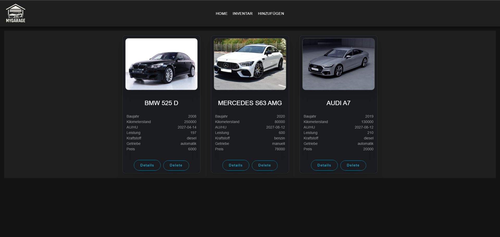
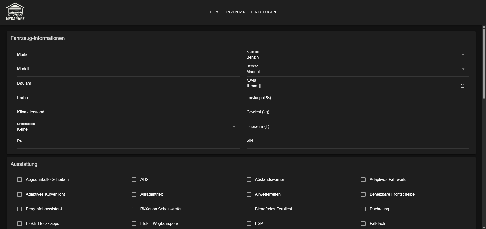
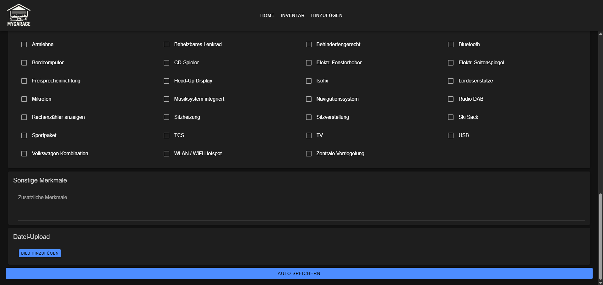
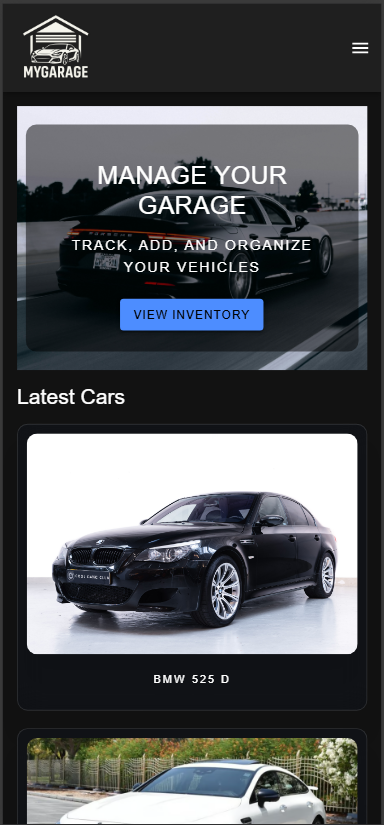
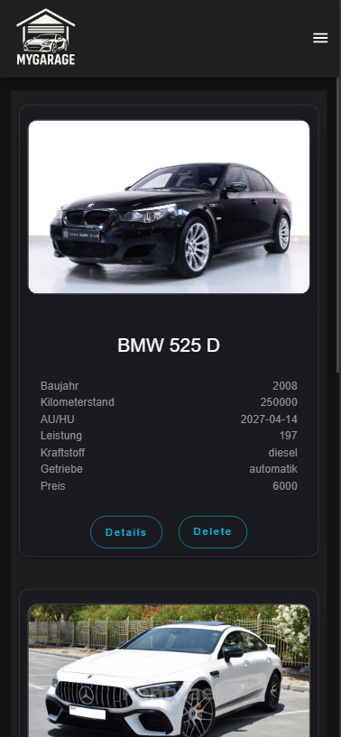
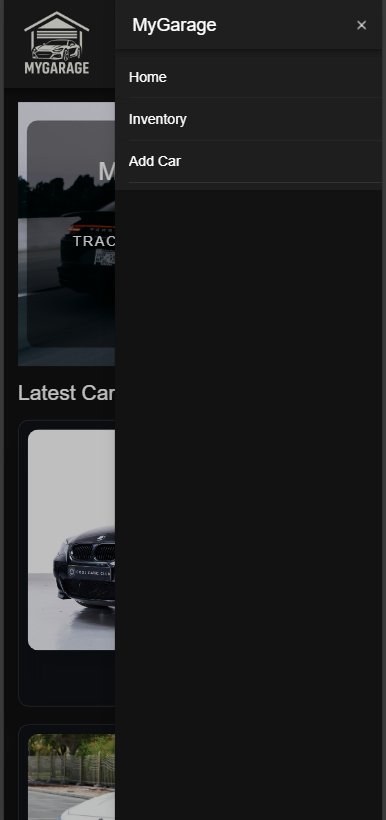
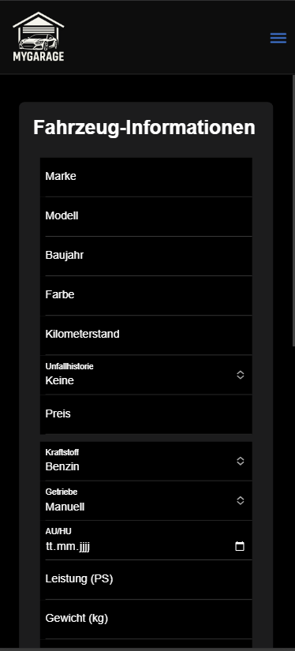
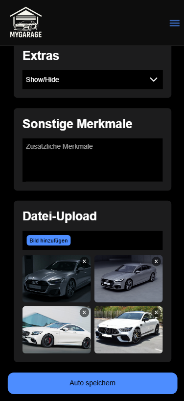
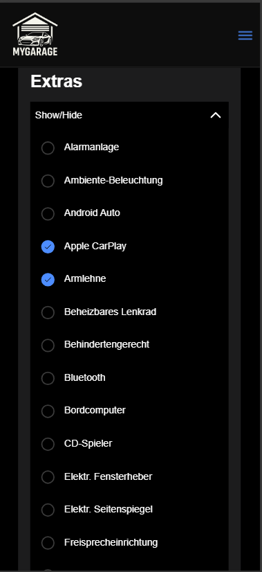

# 🚗 MyGarage App (Frontend)

This is the **frontend** for the MyGarage application, built with **Ionic + React (TypeScript)**.  
It connects to a custom backend implemented in **Django REST Framework**.

➡ **Backend Repository:** [MyGarage Backend (Django REST API)](https://github.com/AbbasEl11/mygarage-backend)

➡ **LIVE DEMO TEST:** [MyGarage](https://abbas-el-mahmoud.com/mygarage-app/index.html#/mygarage-app/home) 

---

## 📌 Project Status Notice

The main focus for this project was learning to integrate a **custom-built API**.  
The UI is functional but intentionally not fully polished yet, as most effort went into backend design and integration.

---

## ✨ Features

- Ionic + React (TypeScript) frontend
- Connects to custom Django REST API
- Vehicle management (list, view, add, edit, delete)
- API service layer (`carService.ts`)
- Mobile-ready (Capacitor + Android)
- Basic theming via `variables.css`

---

## 🛠️ Tech Stack

### Frontend
- Ionic + React (TypeScript)
- Capacitor (Android)
- CSS / Ionic Theme Variables


### Backend
- Django REST Framework (Python)
- SQLite Database
- Custom CRUD Endpoints
- Serialization & API protection


---

## Demo Data

To load demo vehicles into the database, run:

```
python manage.py loaddata cars_fixture.json
```

This will insert sample `Car` records (with image paths) into your local database.

---

## 📚 API Documentation (Swagger)

Interactive API documentation is available via Swagger UI.

**URL:** [http://127.0.0.1:8000/api/docs/](http://127.0.0.1:8000/api/docs/)

You can explore available endpoints, view request/response schemas, and test API calls directly from the browser.

## Screenshots

**MyGarage (Desktop)**








**MyGarage (Mobile)**










## 📂 Project Structure

```
mygarage-app/
├─ public/
├─ src/
│  ├─ components/         # Reusable UI components
│  ├─ pages/              # Main pages (Home, Inventory, AddCar, CarDetails)
│  ├─ services/           # API service logic (carService.ts)
│  ├─ theme/              # Ionic theme variables
│  ├─ storage.ts          # Local storage handling
│  └─ main.tsx
├─ capacitor.config.ts
├─ ionic.config.json
├─ package.json
├─ tsconfig.json
└─ vite.config.ts

```

---

## 🚀 Installation & Run

### Prerequisites
- Node.js >= 18
- npm or yarn
- Ionic CLI (`npm install -g @ionic/cli`)

### Steps
```bash
# Clone
git clone https://github.com/AbbasEl11/mygarage-app.git
cd mygarage-app

# Install dependencies
npm install

# Start in dev mode
npm run dev

# Build for production
npm run build

# (Optional) Sync with Android via Capacitor
ionic build
npx cap sync android
```

---

## Author
Developed by [AbbasEl11](https://https://github.com/AbbasEl11)
